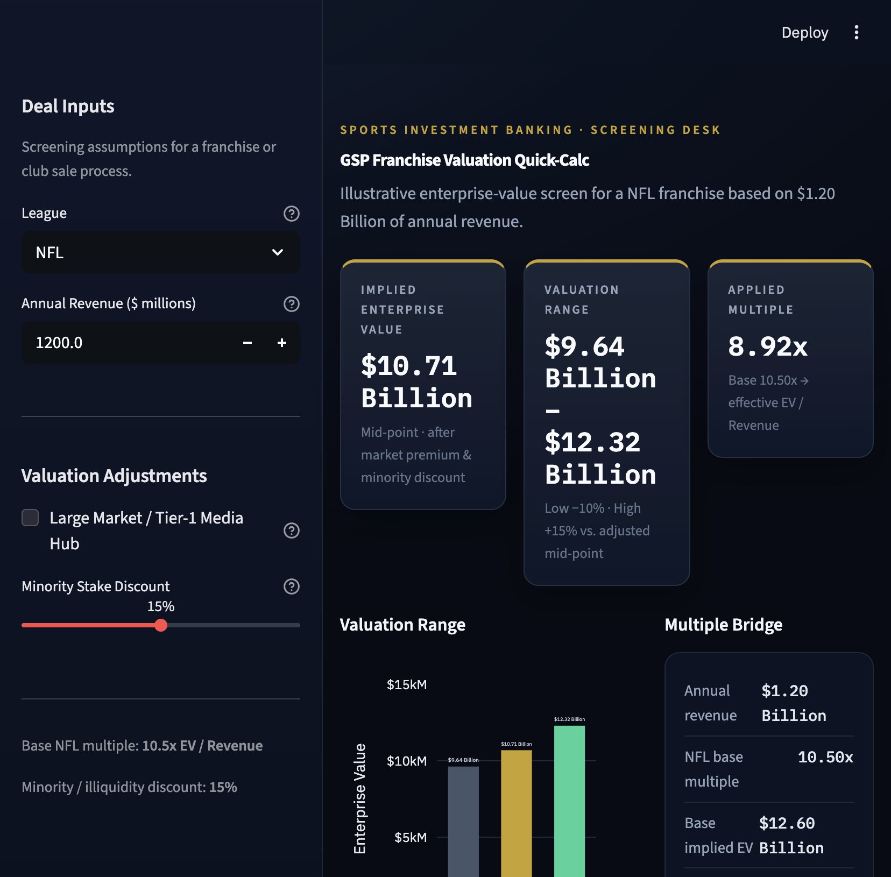

# GSP Franchise Valuation Quick-Calc

Sports investment banking screening tool for franchise enterprise value. Built with Python and Streamlit.

## Demo

NFL example at **$1.20 Billion** of annual revenue, with a **15%** minority / illiquidity discount:



The sidebar sets league, revenue, a Tier-1 media-hub premium, and a minority-stake discount. The main panel shows implied EV, a low / mid / high range, the applied multiple, a valuation bar chart, and an estimated revenue-stream split.

## Run locally

```bash
pip install -r requirements.txt
python3 -m streamlit run app.py
```

Then open [http://localhost:8501](http://localhost:8501).

## How the screen works

1. **Base EV** = annual revenue × league EV/Revenue multiple  
   NFL 10.5x · NBA 9.2x · MLB 7.5x · NHL 6.0x · MLS 5.0x · European Soccer 4.0x
2. Optional **+15%** multiple premium for a Large Market / Tier-1 Media Hub
3. **Minority stake discount** (0–30%) for illiquidity and lack of control
4. **Range** around the adjusted mid-point: −10% / mid / +15%

This is an illustrative screening model, not a fairness opinion or appraisal.
